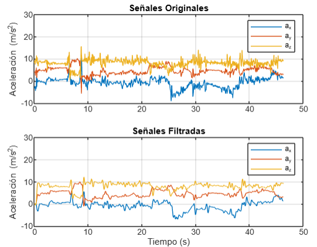
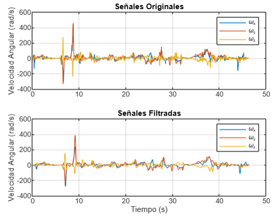

# Odometría de karts con el uso de dispositivos móviles
En el presente repositorio se describe el proceso de tratamiento de datos obtenidos de un recorrido en karts a la plazoleta del edificio CyT en la Universidad Nacional de Colombia, mediante el uso de sensores integrados en dispositivos móviles, con el fin de reconstruir la trayectoria seguida durante el recorrido:

<p align="center">
   <br> 

## Obtención de datos
Para obtener los datos se usa una plataforma denominada Edge Impulse a la cual se conecta el dispositivo móvil con el cual se va tomar la medición; una vez conectado, se fija el tiempo de muestreo y se selecciona el tiempo de medición tal y como se indica en la siguiente imagen:

<p align="center">
   <br> 

Una vez se tienen los datos, se descargan en formato JSON y se cargan al programa Matlab para analizarlos; para poder leer los datos en formato numérico se emplea el siguiente código, donde el parámetro de la función ```fileread()``` es el nombre del archivo que contenga los datos JSON:

```matlab
jsonStr = fileread('Datos_Carlos.json');
DatosJson = jsondecode(jsonStr);
Valores = DatosJson.payload.values;
```

El paso siguiente es definir parámetros generales de los datos obtendos tales como la frecuencia de muestreo y el vector de tiempo, a su vez se definen los vectores de aceleración y velocidad angular obtenidos a partir de la llave de valores legibles del archivo JSON, asegurándose de eliminar los n primeros valores que solo contengan datos en cero, en este caso los primeros 72 valores de ambos vectores eran cero, por lo cual se recortaron dichos valores:

```matlab
Fs = 62.5;
Ts = 1/Fs;
accO = [Valores(72:end,1) Valores(72:end,2) Valores(72:end,3)];
gyrsF = [Valores(72:end,4) Valores(72:end,5) Valores(72:end,6)];
L = size(accO); 
t = (0:L(1)-1)*Ts;
```

Entonces las gráficas de las magnitudes medidas son:

<p align="center">
   <br> 

<p align="center">
   <br> 

## Diseño del filtro
Una vez tenemos los datos del recorrido, diseñamos un filtro para reducir el ruido de las aceleraciones y del giróscopo, para ello primero graficamos el espectro de frecuencias e identificamos la frecuencia en la que se concentra la mayor parte de la potencia de la señal.

```matlab
FrecAccsF = abs(fft(accO));
FrecGyrsF = abs(fft(gyrsF));
frec = Fs/L(1)*(0:L(1)-1);
```

<p align="center">
   <br> 

<p align="center">
   <br> 

Como se puede ver en las gráficas, la mayor parte de la potencia de la señal se concentra por debajo de los 10 Hz, además se comprobó empíricamente que si se eleva la frecuencia de corte las componentes de frecuencias superiores contribuyen al ruido en la señal mientras que si la frecuencia de corte se reduce, la señal pierde mucho potencia y los resultados no son deseados. Por lo cual se debe implementar un filtro pasabajos con frecuencia de corte en 10 Hz para reducir el ruido presente en la señal.

Los parámetros necesarios para caracterizar dicho filtro son: 

+ Banda de Transición ($\Delta \omega$): Representa el intervalo de frecuencias permisibles para que el filtro tenga el efecto deseado en la señal. Es importante aclarar que por el teorema de muestreo de Nyquist cada período se toman dos muestras, por lo cual las frecuencias se deben normalizar usando la siguiente relación:

$$f_N = \frac{f}{2f_s}$$

+ Tolerancia de paso ($\Delta_1$): Representa la magnitud mínima que el filtro le permite reducir a la señal dentro de los límites de la banda de paso. También suele representarse en decibeles mediante la siguiente relación:

$$R_p = 20log_{10}(\frac{1}{1-\Delta_1})$$

+ Tolerancia de rechazo ($\Delta_2$): Representa la magnitud de corte máxima que el filtro debe aplicar a la señal, una vez se sobrepase el límite superior de la banda de transición. Al igual que en la tolerancia de paso, suele representarse en decibeles con la siguiente relación:

$$A_s = 20log_{10}(\frac{1}{\Delta_2})$$

+ Orden del filtro (N): Es un número entero que determina la cantidad de muestras y retardos que emplea el filtro para procesar la señal, entre mayor sea el orden se satisfacen parámetros más estrictos pero se eleva considerablemente el costo computacional, se puede lograr una aproximación del orden que cumpla medianamente bien con los requerimientos en los demás parámetros mediante la siguiente ecuación:

$$N \approx \frac{f_sA_s}{22\Delta f}$$

Para el filtro deseado la banda de transición se establece en 1 Hz, a fin de que no sea tan exigente para la ventana de diseño que se use; la tolerancia de paso se establece en 0.01, dado que no queremos perder más del 1% de la potencia de la señal deseada; y la tolerancia de rechazo se establece en 0.1, con lo cual la señal perderá un 90 % de su potencia tras atravesar la banda de transición, con lo cual el diagrama del filtro queda de la siguiente manera:

<p align="center">
   <br> 

Teniendo en cuenta los parámetros anteriores, el filtro que mejor se adapta a las condiciones establecidas y no consume tantos recursos computacionales es un filtro FIR pasabajos con frecuencia normalizada de corte en 0.08 Hz y ventana de Chebysev de orden 57 y tolerancia de rechazo de 20 dB. Entonces su implementación en Matlab viene dada por:

```matlab
DeltaT = 1;
DeltaR = 10^(-1);
As = 20*log10(1/DeltaR);
n = round(Fs*As/(DeltaT*22));
f = 10/(2*Fs);
filtro = fir1(n,f,"low",chebwin(n+1,As));
acc = filter(filtro,1,accO);
gyr = filter(filtro,1,gyrsF);
```
<p align="center">
   <br> 

Como se puede observar en el diagrama Bode, el filtro desfasa la señal, por lo cual se debe corregir ese desfase recortando la parte de la señal que se desplazó, entonces se usa la función ```grpdelay()``` para calcular el desfase que se le imprime a la señal, para posteriormente recortar la señal filtrada:

```matlab
delay = ceil(mean(grpdelay(filtro)));
tt = t(1:end-delay);
accn = accO(1:end-delay,:);
accf = acc;
accf(1:delay,:) = [];
gyrn = gyrsF(1:end-delay,:);
gyrf = gyr;
gyrf(1:delay,:) = [];
l = size(accf);
```

Con lo cual, los resultados de la aplicación del filtro y la correción del desfase en los vectores de aceleración y velocidad angular son:

<p align="center">
   <br> 

<p align="center">
   <br> 

## Eliminación del efecto de la gravedad
Como se empleó una IMU para adquirir los datos del recorrido en karts, esta también considera las aceleraciones de la gravedad sobre el dispositivo movil, por lo cual se debe eliminar dicho efecto sobre el vector total de aceleraciones, para ello se asume que el vector de aceleración después del filtro es una combinación líneal de la aceleración deseada que es ortogonal a un vector totalmente vertical de magnitud igual a 9.8 $m/s^2$ que representa la gravedad. 

<p align="center">
   <br> 

Entonces, la magnitud del vector de aceleración deseado estaría dada por el teorema de Pitágoras.

$$a_d =\sqrt{a_m^2-g^2}$$

Una vez conocida la magnitud de la aceleración deseada, se determina el coseno entre la aceleración deseada y la aceleración medida, a fin de proyectar las componentes de la aceleración deseada en el sistema rotado del móvil con el uso de los cosenos directores del vector de acelación medida:

$$\vec{a_{d_r}} = \vec{a_d}sen(\gamma)cos(\theta_m)$$

```matlab
accTot = sqrt(accf(:,1).^2+accf(:,2).^2+accf(:,3).^2);
Gamma = acos(9.81./accTot);
MagAccD  = sqrt(abs(accTot.^2-9.81^2));
cosD = [accf(:,1)./accTot accf(:,2)./accTot accf(:,3)./accTot];
accsG = MagAccD.*sin(Gamma).*cosD;
```

 Una vez se aplica la corrección por efectos de gravedad a la aceleración medida, se asume que la aceleración obtenida representa la aceleración tangencial del centro de masa del móvil en el Kart para facilitar los cálculos de la trayectoria, dado que suponemos que dicho vector al igual que la aceleración tangencial brinda únicamente los valores en la dirección en la que se mueve el kart:

<p align="center">
   <br> 

## Obtención de la velocidad y posición angular
Una vez tenemos filtrados los datos del vector de velocidad angular dado por las mediciones del giróscopo, se obtiene el vector de posición angular teniendo en cuenta que ambas magnitudes se relacionan mediante la siguiente ecuación diferencial:

$$\frac{d\vec{\theta}(t)}{dt}=\vec{\omega}(t)$$

Para resolver esta ecuación empleamos el método de Euler teniendo en cuenta que el paso h viene dado por el tiempo de muestreo de nuestro dispositivo móvil y la posición angular inicial del kart es 0 rad/s:

$$\vec{\theta}_{k+1}=\vec{\theta}_k+T_s\vec{\omega}_k$$

```matlab
for j=1:l(2)
    Ang(1,j) = 0;
    for i=1:l(1)-1
        Ang(i+1,j) = Ang(i,j)+Ts*gyr(i,j);
    end
end
```

Las posiciones angulares obtenidas son:

<p align="center">
   <br> 

Al igual que en el anterior caso, la velocidad y la aceleración del kart en coordenadas cartesianas se relacionan mediante una ecuación diferencial dependiente del tiempo:

$$\frac{d\vec{v}(t)}{dt}=\vec{a}(t)$$

Para resolver esta ecuación también empleamos el método de Euler teniendo en cuenta las consideraciones del paso y condiciones iniciales iguales a cero:

$$\vec{v}_{k+1}=\vec{v}_k+T_s\vec{a}_k$$

```matlab
for j=1:l(2)
    Vel(1,j) = 0;
    for i=1:l(1)-1
        Vel(i+1,j) = Vel(i,j)+Ts*accsG(i,j);
    end
end
```

Con lo cual las velocidades obtenidas son:

<p align="center">
   <br> 

## Obtención de la trayectoria
Para obtener la trayectoría del kart en coordenadas cartesianas se debe tener en cuenta que en cada punto el sistema de referencia rota con respecto al primer punto de medición, un ángulo determinado por el vector de posición angular, por lo cual se debe aplicar una matriz de corrección cuyas componentes se calculan con la primera componente del vector de posición angular, en este caso la del eje x dado que su velocidad es la de menor magnitud, por lo cual su mayor contribución al movimiento del kart es el cambio de dirección:

$$Rot_k = \begin{pmatrix}
1 & 0 & 0\\
0 & cos(\theta_{1_k}) & sen(\theta_{1_k})\\
0 & -sen(\theta_{1_k}) & cos(\theta_{1_k})\\
\end{pmatrix}$$

Una vez se tiene la matriz de corrección de dirección, se necesita complementar con el vector de velocidades obtenido en el paso anterior para determinar el cambio de magnitud en la posición, para ello se emplea la ecuación diferencial que relaciona ambas componentes:

$$\frac{d\vec{r}(t)}{dt}=\vec{v}(t)$$

Entonces la solución a dicha ecuación viene dada por el método de Euler con paso igual a $T_s$, condiciones iniciales iguales a cero y factor de corrección de dirección dado por la matriz de rotación:

$$\vec{r}_{k+1}=\vec{r}_k+T_s\vec{v}_kRot_k$$

```matlab
for j=1:L(2)
    Pos(1,j) = 0;
    for i=1:L(1)-1
        Pos(i+1,j) = Pos(i,j)+Ts*Vel(i,j);
    end
end
```
Con lo cual la trayectoria final obtenida es:

<p align="center">
   <br> 
